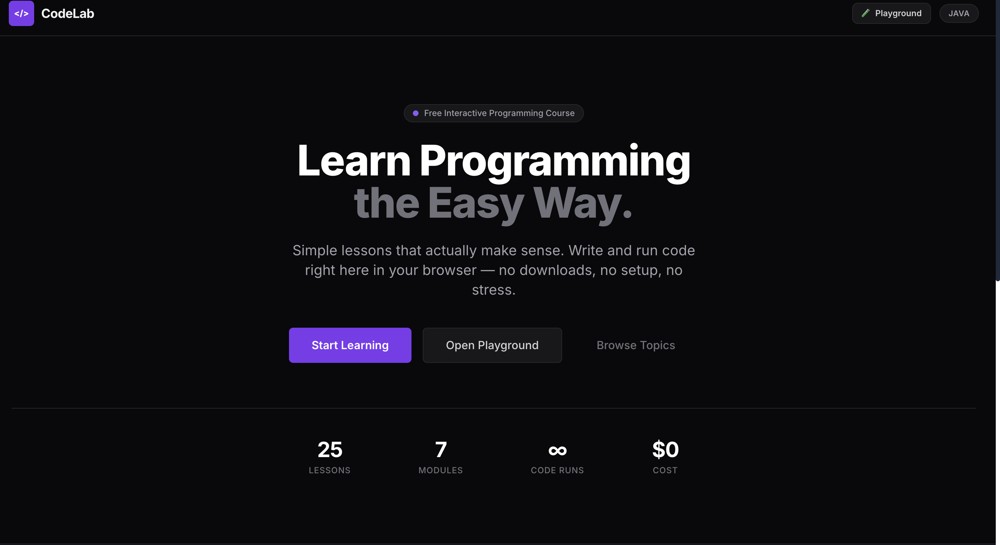

# CodeLab — Interactive Java Learning Platform

CodeLab is a modern, interactive platform designed to teach Java programming to absolute beginners. It features a "Zen Minimalist" aesthetic to provide a distraction-free learning environment.



## Features

- **Zen Minimalist Design**: A clean, flat interface with a dark matte theme (Zinc & Violet) to reduce eye strain and distractions.
- **Interactive Playground**: Write and run Java code directly in the browser—no installation required.
- **Structured Lessons**: Bite-sized lessons covering everything from "What is Programming?" to complex Java concepts.
- **Real-time Code Execution**: Powered by a robust backend to compile and run Java code instantly.
- **Responsive Layout**: Optimized for both desktop and tablet learning.

## Tech Stack

- **Frontend**: React, Vite
- **Styling**: Tailwind CSS (Custom "Zen" configuration)
- **Code Editor**: CodeMirror 6
- **Icons**: Emoji & Custom SVG assets
- **Deployment**: Vercel (Recommended)

## Getting Started

### Prerequisites

- Node.js (v16 or higher)
- npm or yarn

### Installation

1.  Clone the repository:

    ```bash
    git clone https://github.com/Don-Vicks/codelab.git
    cd codelab
    ```

2.  Install dependencies:

    ```bash
    npm install
    ```

3.  Start the development server:

    ```bash
    npm run dev
    ```

4.  Open your browser and navigate to `http://localhost:5173`.

## Project Structure

```text
src/
├── components/     # UI Components (Header, Sidebar, Editor, etc.)
├── data/           # Lesson content and module data
├── utils/          # Helper functions (API clients, etc.)
├── App.jsx         # Main application layout
├── main.jsx        # Entry point
└── index.css       # Global styles and Tailwind imports
```

## Contributing

Contributions are welcome! Please feel free to submit a Pull Request.

## License

This project is open-source and available under the MIT License.

## Credits

Built by [Victor Shallangwa](https://donvicks.dev).
